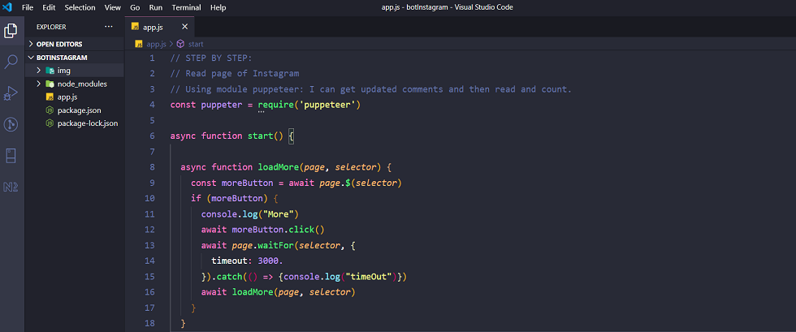
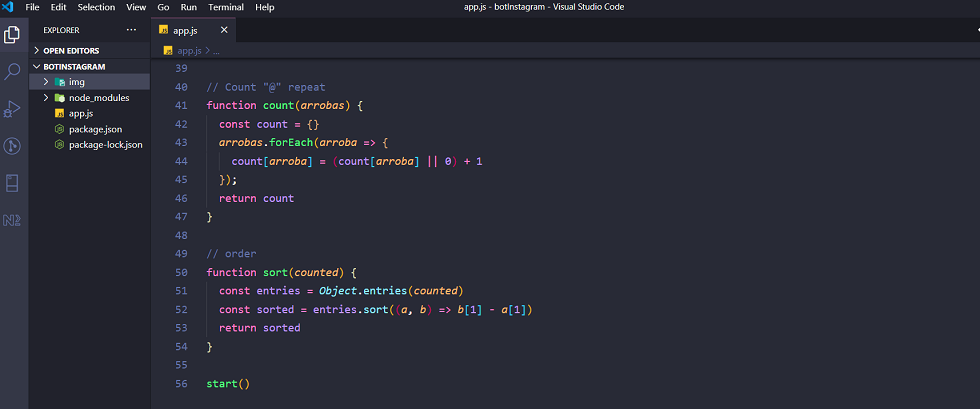
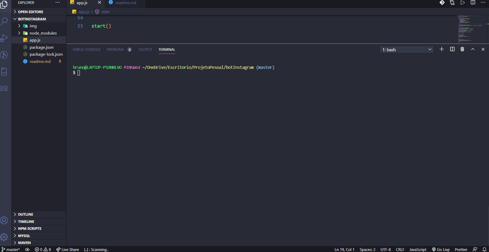

# 💻 Bot for read comment's in Instagram
<a href="#tecnologies" >Tecnologies </a> 

Here I developed, along with Igor Oliveira from the YouTube channel  <a href="https://www.youtube.com/channel/UCrdgeUeCll2QKmqmihIgKBQ" >ProgramadorBR</a> , a "bot" that counts the amount of comments in a post on instagram. With the intention of automating tasks of digital influencers who usually have many comments in each of their posts.
  

#  Puppeteer

Through the <a href="https://www.youtube.com/channel/UCrdgeUeCll2QKmqmihIgKBQ" >ProgramadorBR</a>  channel I learned about the pupperteer module that allows me to create an automated and updated test environment.

- Running tests directly on the latest version of Chrome using the latest JavaScript and browser features.

- In addition to allowing me to track a SPA (single page application) and generate pre-rendered content (ie "SSR" (server-side rendering)). 

- <a href="https://pptr.dev/"> Read more about Puppeteer</a>   

 
 
 
  

# 

 🚀 Tecnologies

- JavaScript 
- Node.js
- Module Puppeteer